# BED2 Cloud and Deployment Services - CA submission

> Fill this in and export it as one PDF named `<noroff-username>_CDS_CA_1.pdf`. Replace every italic placeholder, including the image paths. Keep the numbering and the order - it is the order the work is marked in, and a marker who cannot find a screenshot cannot award the row it was evidence for.
>
> The brief is in [cds-spec.md](cds-spec.md). Read it first.

## 1. Front matter

| Field | Your answer |
|---|---|
| Name | *your full name* |
| Noroff username | *the part of your Noroff email before the `@`* |
| Repository URL | *https://github.com/your-username/cds26-facts-api* |

The repository must be private, with `NicholasLennox` added as a Contributor. Only commits made before the deadline count.

## 2. Part A: the practical (70 marks)

Eleven screenshots, numbered and in order. Put each image where its placeholder is.

### 2.1 Screenshot 1 - Tests passing locally

*Stage 2. The command and the summary line both visible.*

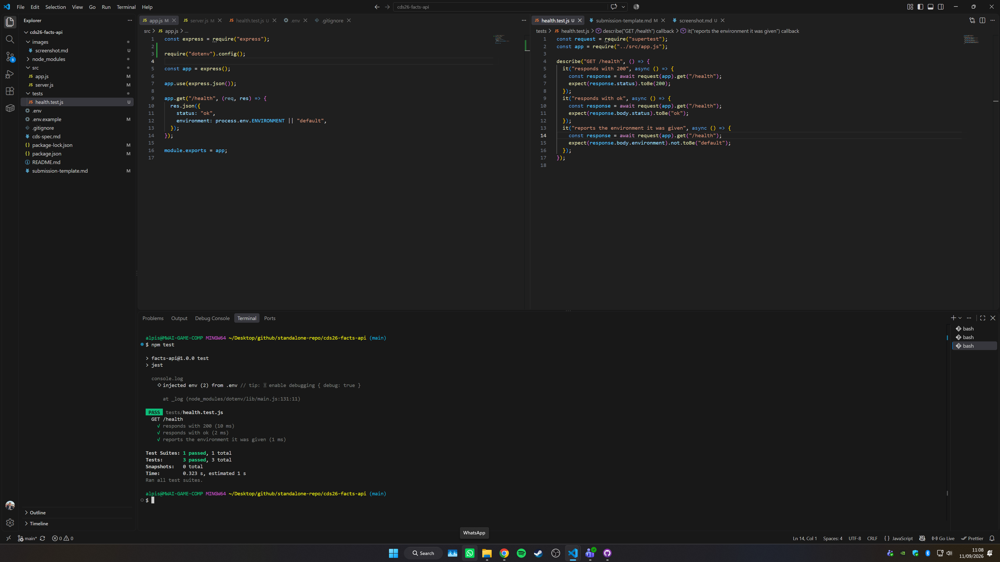

### 2.2 Screenshot 2 - Compose running, `/health` reporting `local`

*Stage 4. One image with both windows visible is preferred. Two separate images are accepted.*

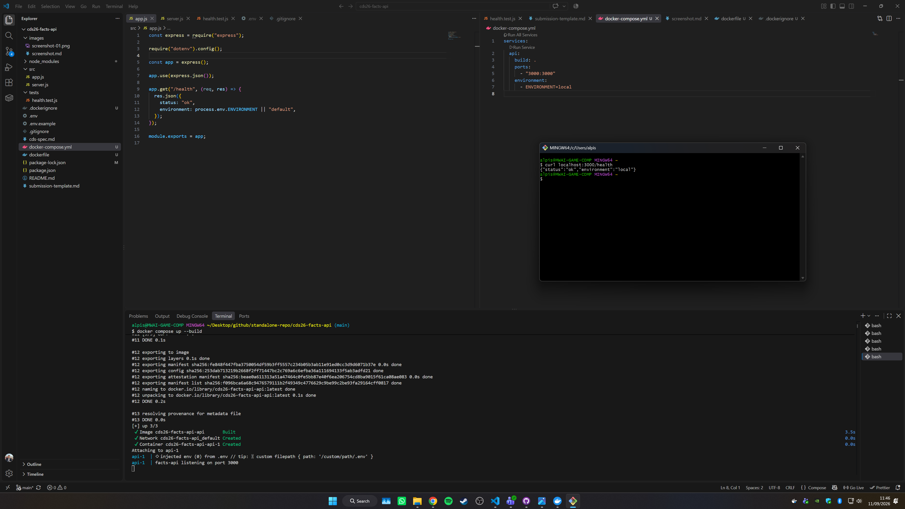

### 2.3 Screenshot 3 - The Actions run

*Stage 5. Both jobs green, with `test` shown before `build-and-push`.*

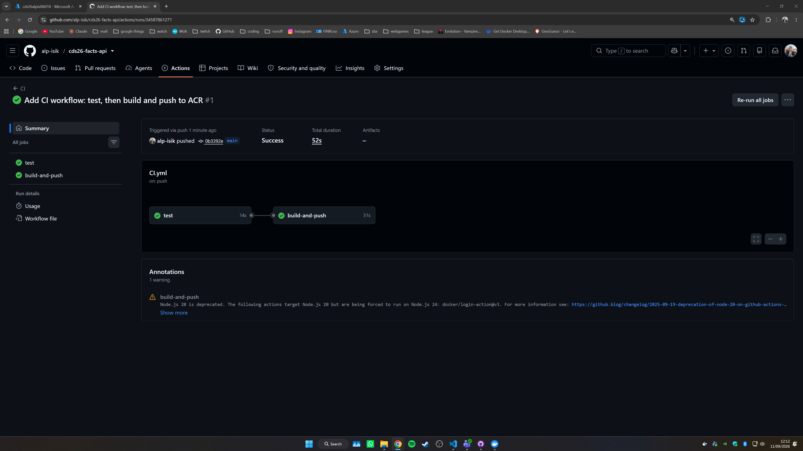

### 2.4 Screenshot 4 - The ACR repository

*Stage 5. Both tags, `latest` and the 7-character short SHA, against the same build.*

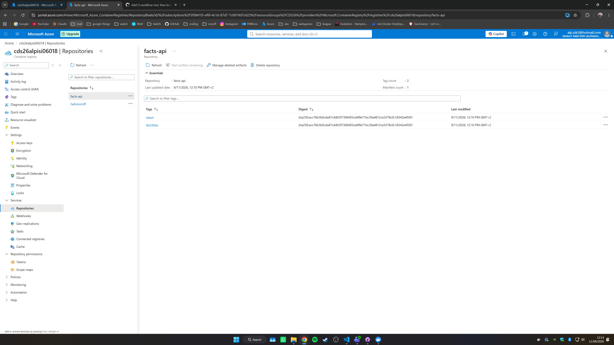

### 2.5 Screenshot 5 - The Environment variables blade

*Stage 6. The registry credentials and `ENVIRONMENT`.*

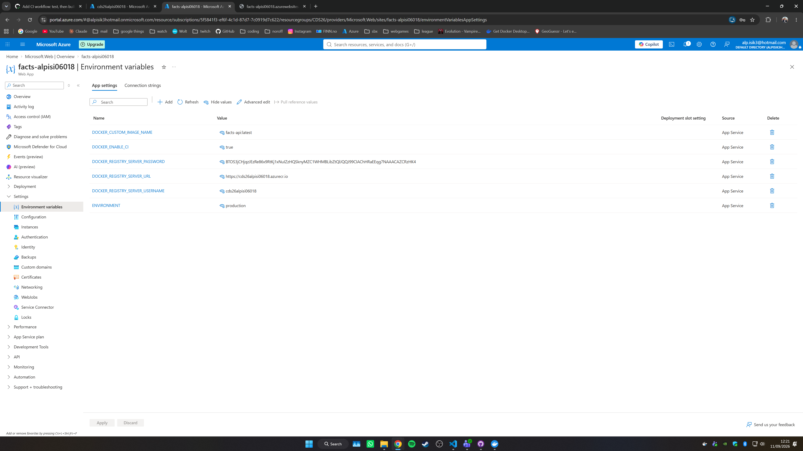

### 2.6 Screenshot 6 - The Deployment Center

*Stage 6. Continuous deployment enabled, and the image and tag being pulled.*

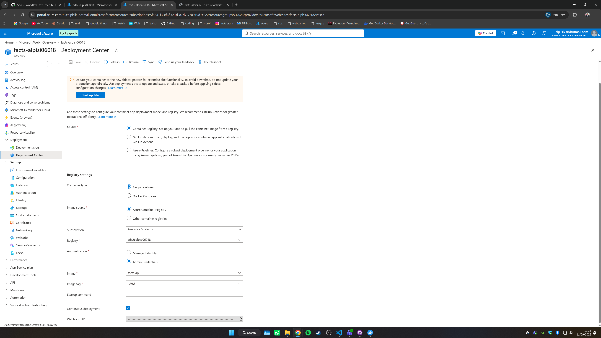

### 2.7 Screenshot 7 - The registry's Webhooks blade

*Stage 6. The webhook and its scope.*

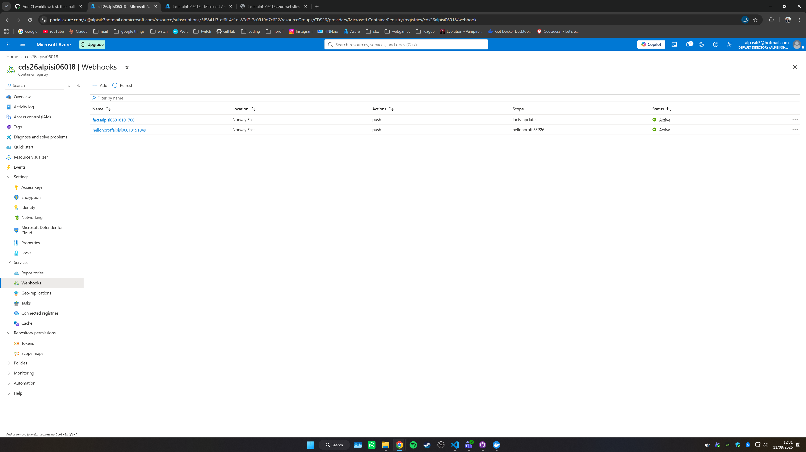

### 2.8 Screenshot 8 - `/health` on the App Service URL

*Stage 6. Reporting `production`.*

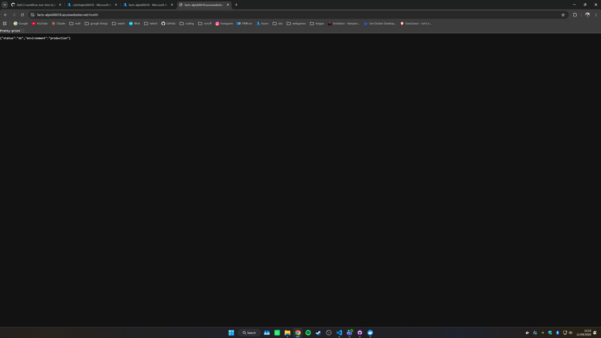

### 2.9 Screenshot 9 - The webhook event log

*Stage 7. A `202` against your most recent push.*

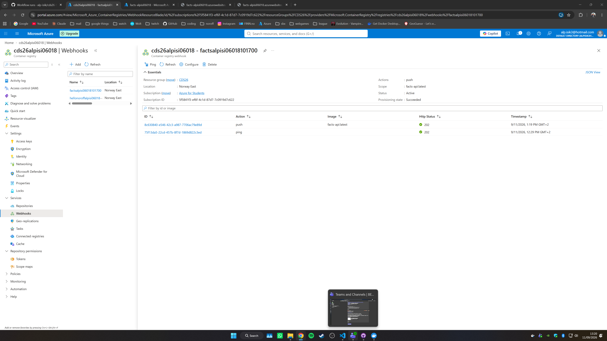

### 2.10 Screenshot 10 - `/fact` on the App Service URL

*Stage 7.*

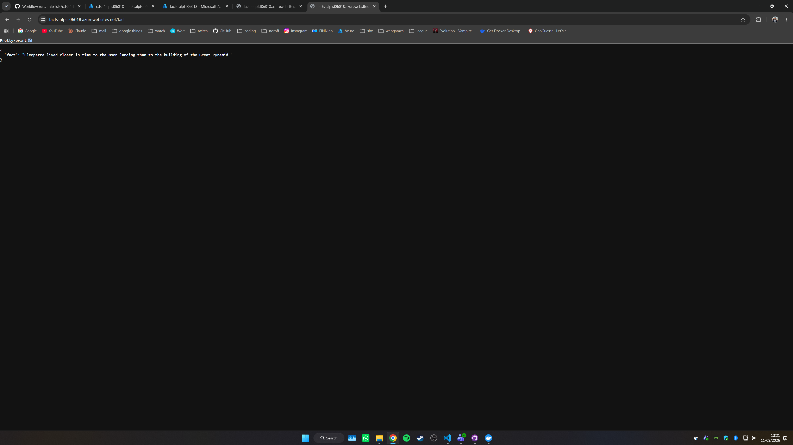

### 2.11 Screenshot 11 - Cost analysis for `CDS26`

*Stage 8. Scoped to the year, with the accumulated cost and the forecast both visible. A zero, or a dash where a figure would be, is a complete answer.*

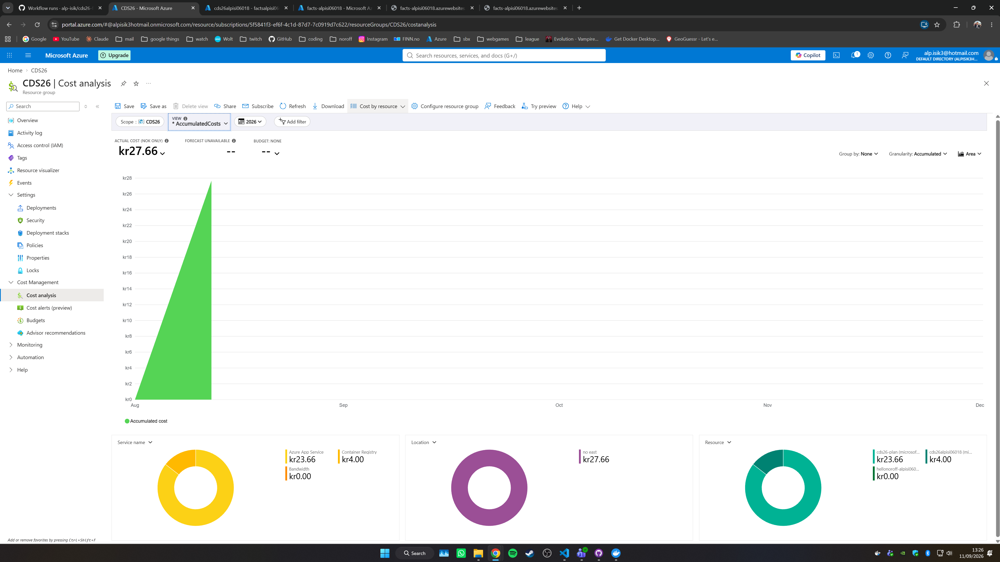

## 3. Part B: the long-form questions (20 marks)

The mark value tells you how much to write. The guide length is a guide, not a limit.

### 3.1 Question 1 - Build-time and run-time configuration (3 marks)

*~ 150-250 words.*

Configuration can be fixed into an image when it is built, or supplied to a container when it is run. Explain the difference between the two, and why run-time configuration is what anything deployed generally uses.

**Answer:**

*Your answer here.*

### 3.2 Question 2 - Dev dependencies in two places (2 marks)

*~ 100-150 words.*

Your Dockerfile installs production dependencies only, so the image contains no dev dependencies. Your CI workflow installs everything, so the test job has them. Explain why both of those are correct, and say what specifically goes wrong in each place if the two are swapped.

**Answer:**

*Your answer here.*

### 3.3 Question 3 - From a push to a live URL (5 marks)

*~ 300-400 words, or a diagram plus 150.*

Describe everything that happens between a developer running `git push` and the new code answering requests on the public URL, in the setup you built. Name what triggers each step, and what would have to be true for that step to happen at all.

You can submit a diagram as part of this answer. If you do, label the arrows with what causes each one.

**Answer:**

*Your answer here. If you are including a diagram, put it here as an image.*

### 3.4 Question 4 - Reading a webhook response (3 marks)

*~ 150-250 words.*

Your registry's webhook event log shows a `202` against your most recent push. What has happened at the moment that status is returned, and what has not? What would a `401` mean instead, and what would you check first?

**Answer:**

*Your answer here.*

### 3.5 Question 5 - The same system on another provider (3 marks)

*~ 200-300 words, plus citations.*

The same application could be delivered on AWS or on Google Cloud. Pick one. Name the service you would use at each step of the workflow you built - registry, hosting, and the identity the pipeline authenticates with - and identify at least one place where the shape of the work changes rather than just the name.

**Answer:**

*Your answer here.*

**Citation:**

*The provider documentation you used, by title and link.*

### 3.6 Question 6 - What the SLA actually promises (2 marks)

*~ 100-200 words, plus a citation.*

Find the SLA for Azure App Service on a paid tier. State the committed monthly uptime and what that allows in minutes of downtime per month. Say what you receive if the provider misses it, and name one thing the SLA does not cover.

**Answer:**

*Your answer here.*

**Citation:**

*The document you read, by title and link.*

### 3.7 Question 7 - Where the gate sits (2 marks)

*~ 100-150 words.*

Your workflow runs on push to `main`. That does not stop broken code reaching `main`. Explain what changes if the same workflow runs on pull requests into `main` instead. What does that protect against, and what does it still not protect against?

**Answer:**

*Your answer here.*

## 4. Part C: the quiz (10 marks)

Ten questions, one mark each. One letter per question. Put your letter on the **Answer** line under each question, and repeat all ten in the grid in §4.11.

### 4.1 Question 1

Two articles are published in the same week. One is headed "Microsoft leads the cloud market", the other "AWS leads the cloud market". Both cite market research firms, and both report figures for the same quarter. What best explains the two headlines?

- **A.** Only one can be correct, since the market has a single leader.
- **B.** The figures come from published accounts, so one of them contains an error.
- **C.** They are counting different markets, and infrastructure and SaaS have different leaders.
- **D.** Estimates move each quarter, so the two were measured at different times.

**Answer:**

### 4.2 Question 2

A dental practice moves its appointment system from IaaS to PaaS. Which responsibility passes to the provider?

- **A.** Applying operating system security updates.
- **B.** Deciding who in the practice can see which patient record.
- **C.** Keeping their appointment code free of bugs.
- **D.** Choosing how much capacity to pay for.

**Answer:**

### 4.3 Question 3

A seed bank's IT lead tells the board that the organisation is "moving to the public cloud, which means we are moving to SaaS." Why is that reasoning wrong?

- **A.** Public cloud means renting infrastructure, so the move is to IaaS rather than SaaS.
- **B.** SaaS is bought from a vendor rather than deployed, so an organisation cannot "move to" it at all.
- **C.** SaaS requires a private cloud, because the vendor holds the data.
- **D.** Deployment model says who else is on the hardware; service model says how much of the stack you rent, and neither implies the other.

**Answer:**

### 4.4 Question 4

A laundrette chain runs its booking system on PaaS. A customer list leaks after one of its developers leaves a storage container set to public. The platform ran normally throughout. Who is accountable?

- **A.** The provider, since on PaaS it manages the platform the storage sits on.
- **B.** The customer, because access configuration and data stay with them in every model.
- **C.** Shared, because the storage service is the provider's product.
- **D.** The provider, because the SLA was not met while data was exposed.

**Answer:**

### 4.5 Question 5

A bookbinder's accountant is pleased that moving to a cloud provider turned a large one-off purchase into a predictable monthly charge. What has the bookbinder given up in exchange?

- **A.** The ability to scale capacity up and down with demand.
- **B.** Ownership of the data, which now belongs to the provider.
- **C.** Any way of forecasting what the service will cost.
- **D.** An owned asset written off over its life, replaced by a cost that never ends.

**Answer:**

### 4.6 Question 6

A wind farm's monitoring team runs six services, each in its own container, on one Linux host. A colleague says that means six operating systems on one machine. Why is that wrong?

- **A.** Each container runs a cut-down operating system instead of a full one.
- **B.** They share the host's kernel and carry only each service's own libraries and files.
- **C.** There is one operating system per host regardless, because the hypervisor supplies it.
- **D.** There are seven, once the host's own is counted.

**Answer:**

### 4.7 Question 7

A fish market's price-feed API listens on port 4000, and its Dockerfile contains `EXPOSE 4000`. A developer runs `docker run -d fishprices` and cannot reach the API at `localhost:4000` in a browser. What is wrong?

- **A.** `EXPOSE` documents the port, and nothing was published to the host, so `-p 4000:4000` is missing.
- **B.** `EXPOSE` publishes the port, so the application must not be listening on it.
- **C.** The container has to join a user-defined network before the host can reach it.
- **D.** `EXPOSE` takes effect only when the image is run through Compose.

**Answer:**

### 4.8 Question 8

A choir-booking API builds without error, but the image comes out at 900 MB and the container crashes on start with a message about a native module built for a different platform. The developer builds on a Mac, and the repository has no `.dockerignore`. What happened?

- **A.** The base image is too large and should be swapped for an Alpine variant.
- **B.** `npm ci` installed the wrong architecture, because the lockfile was copied first.
- **C.** The local `node_modules` was copied in and overwrote what `npm ci` had installed.
- **D.** `--omit=dev` was missing, so the dev dependencies ended up in the image.

**Answer:**

### 4.9 Question 9

A tide-table API is a single service with no database. `docker run -e ENVIRONMENT=local -p 3000:3000 tides` starts it, and so does a one-service `docker-compose.yml`. What does Compose give the team that the `docker run` line does not?

- **A.** It builds and runs in one command, which is fewer keystrokes than two.
- **B.** The run configuration is written down in a committed file, so it is identical for everyone.
- **C.** It injects environment variables, which `docker run` cannot do.
- **D.** It restarts the container automatically whenever the source changes.

**Answer:**

### 4.10 Question 10

An insurance claims desk's pipeline pushes every build to the registry tagged `latest`, and nothing else. Production pulls `latest`. A release goes bad and they want the previous image back. What stops them?

- **A.** `latest` is a reserved tag and images carrying it cannot be pulled by digest.
- **B.** The registry deletes an image as soon as a later build overwrites its tag.
- **C.** Every build moved `latest` onto a new image, so no tag names the previous one.
- **D.** App Service stores only the image it is running, so the old one is gone.

**Answer:**

### 4.11 Answer grid

This grid is what is marked. If it disagrees with a letter you wrote above, the grid wins.

| Q | 1 | 2 | 3 | 4 | 5 | 6 | 7 | 8 | 9 | 10 |
|---|---|---|---|---|---|---|---|---|---|---|
| **Answer** | | | | | | | | | | |

## 5. Before you submit

- [ ] Every italic placeholder replaced, and the eleven screenshots are images.
- [ ] The repository link at the top works, and `NicholasLennox` is a Contributor.
- [ ] Screenshot 9 is the `202` against your **most recent** push, not an earlier row.
- [ ] Questions 5 and 6 each carry a citation.
- [ ] The answer grid in §4.11 has ten letters in it.
- [ ] Exported as one PDF, named `<noroff-username>_CDS_CA_1.pdf`.
- [ ] The `CDS26` resource group is still there. Delete it **after** you submit.
